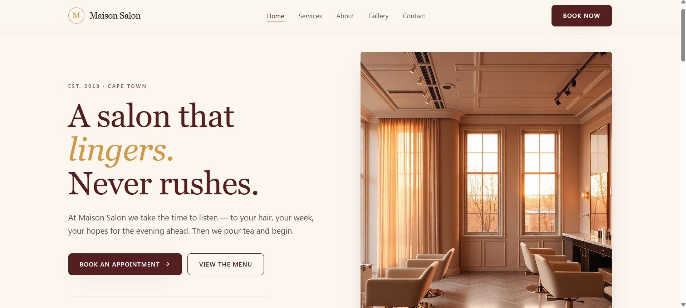

# Maison Salon — B2C Salon Website

A modern, fully responsive salon website built as a practical web development
assessment. The project includes a complete booking system with a live
calendar, dynamic time slots, and a WhatsApp-based confirmation flow.

**Live site:** [(https://salon-shop-seven.vercel.app/)]
**Repository:** [(https://github.com/shy908/salon-shop.git)]



---

## Project Overview

Maison Salon is a fictional Cape Town hair and beauty salon. The brief asked
for a modern B2C business website with a working demo booking experience, no
dead-end interactions, and strong performance/accessibility scores. This
project focuses on:

- A warm, editorial visual identity (deep burgundy, brushed gold, cream —
  built with OKLCH colors) rather than a generic template look
- A four-step booking wizard: service → date & time → details → confirmation
- Real business-hours logic driving which calendar dates and time slots are
  bookable
- A WhatsApp hand-off instead of a real backend, so a booking becomes a
  pre-filled message the salon owner can act on immediately
- Full keyboard and screen-reader accessibility on all interactive elements

## Technologies Used

| Tool | Why |
|---|---|
| **React + Vite** | Fast dev experience, component-based UI for the multi-step booking flow |
| **React Router** | Client-side routing between Home / Services / About / Gallery / Contact / Booking |
| **TypeScript** | Type safety for booking state, service data, and form validation |
| **Tailwind CSS v4** | Utility-first styling, custom design tokens (`@theme`), fast responsive breakpoints |
| **Zod** | Schema validation for the contact form and booking details form |
| **Framer Motion** | Page transitions between routes |
| **Sonner** | Toast notifications for form feedback |
| **Lucide React** | Icon set used throughout the UI |

## Features Implemented

- **Home** — hero section, service highlights, gallery preview, testimonial, booking CTA
- **Services** — full price list grouped by category, each linking directly into the booking flow with the service pre-selected
- **About** — salon story, values, team bios
- **Gallery** — filterable image grid with a click-to-enlarge lightbox
- **Contact** — validated contact form with inline error states, opening hours, map link
- **Booking** — 4-step wizard:
  1. Choose a service
  2. Pick a date (calendar auto-disables past dates and closed days) and an available time slot (auto-generated from opening hours + service duration)
  3. Enter contact details (validated)
  4. Confirmation screen with a booking reference and a pre-filled WhatsApp message
- **No dead ends** — every button, link, and form gives visible feedback (loading states, disabled states, validation errors, hover/focus states)
- **Accessibility** — semantic landmarks, labeled form fields, `aria-pressed`/`aria-disabled`/`aria-selected` on interactive controls, visible focus rings, alt text on all images
- **Responsive design** — mobile, tablet, and desktop layouts throughout, with a collapsible mobile nav

## Setup Instructions

```bash
# 1. Clone the repository
git clone https://github.com/shy908/salon-shop.git
cd salon-shop

# 2. Install dependencies
npm install

# 3. Run the dev server
npm run dev

# 4. Build for production
npm run build

# 5. Preview the production build locally
npm run preview
```

## Deployment

This project is deployed on [Vercel](https://vercel.com). To deploy your own copy:

1. Push the repository to GitHub
2. Import the repo in Vercel
3. Framework preset: **Vite**
4. Build command: `npm run build` — Output directory: `dist`
5. Deploy

## Notes on the Booking System

There is no real backend in this demo. Availability is generated
deterministically from the salon's configured opening hours
(`src/lib/salon-config.ts`), and a small hashing function simulates a
realistic mix of already-taken slots per day so the calendar never looks
empty. On submission, a booking reference is generated client-side and a
WhatsApp deep link (`wa.me`) is built with the service, date, time, and
customer name pre-filled — this is the intended "confirmation" mechanism
for a small business that manages bookings manually.

## License

This project was built for assessment purposes.